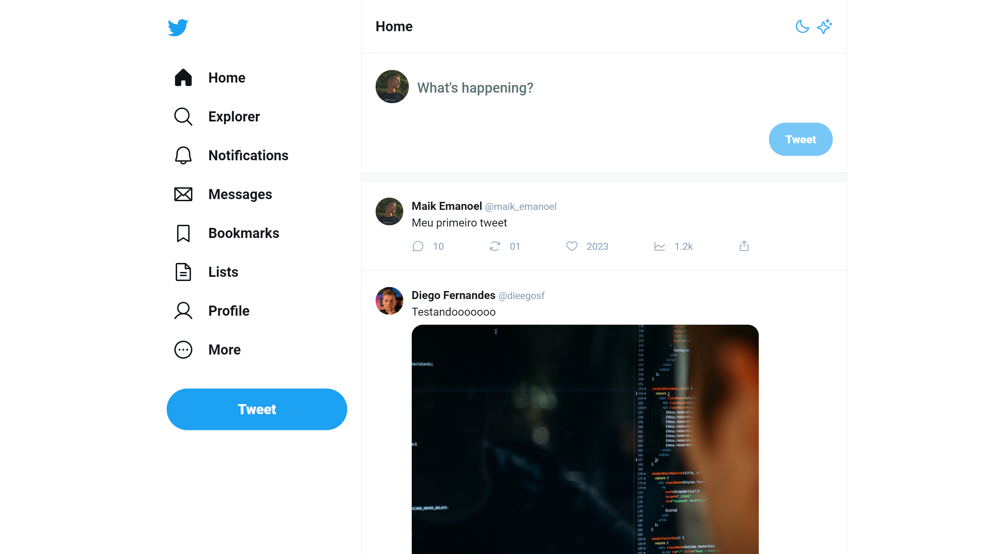

<h1 align="center"> Twitter UI </h1>

[Clique aqui para acessar](https://twitter-ui-ruddy.vercel.app/)

## 🚀 Tecnologias

Esse projeto foi desenvolvido com as seguintes tecnologias:

- [React](https://react.dev/)
- [Typescript](https://www.typescriptlang.org/)
- [Tailwind CSS](https://tailwindcss.com/)
- Git and GitHub

## 💻 Projeto

O projeto "Twitter UI" é uma recriação da interface do Twitter, desenvolvida inicialmente como parte de uma MasterClass da [Rocketseat](https://rocketseat.com.br). Este projeto foi expandido para incluir várias melhorias, recursos adicionais e deixá-lo o mais parecido possível com o Twitter original.  

Após o desenvolvimento inicial do projeto, fiz algumas melhorias/adições. Segue abaixo algumas delas:

- Layout responsivo (Adaptado para telas menores);
- Modo Dark;
- Efeitos hover/active e animações;
- Remodelação do layout para mobile;
- Novos botões;
- Maior quantidade de Tweets;
- Funcionalidade de dar "like";
- Suporte a imagens em Tweets;
- Mais usuários iniciais, que inclui alguns do meus instrutores da Rocketseat;
- Entre outras pequenas funcionalidades e melhorias.

## 🔖 Layout

Você pode visualizar o layout do projeto proposto através [DESSE LINK](https://www.figma.com/community/file/1202694130789327431). É necessário ter conta no [Figma](https://figma.com) para acessá-lo.